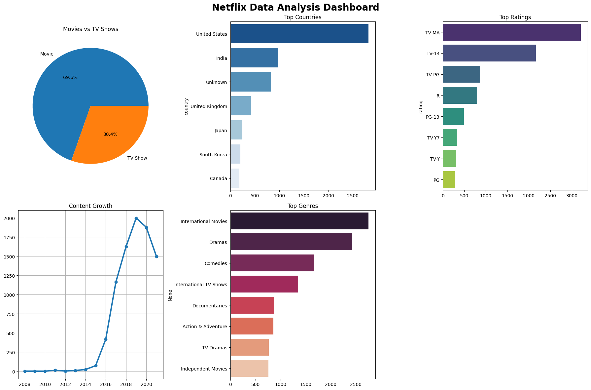

# 🎬 **Netflix Data Analysis Dashboard**
### Data Analyst Portfolio Project | 8,807 Titles Analyzed

## 📊 **Interactive Dashboard**

## 🔥 **Key Business Insights**
- 🎥 **69.6% Movies (6,131)** vs 📺 **30.4% TV Shows (2,676)**
- 🇺🇸 **United States leads** with **2,818 titles (32% of catalog)**
- 🌍 **International Movies #1** (**2,752 titles**)
- 📈 **Peak growth 2019** (**1,999 new titles**)

## 🛠️ Technical Implementation
Tech Stack: Python 3.9 | Pandas | Matplotlib | Seaborn | Jupyter
Dataset: 8,807 Netflix titles (Kaggle)
Analysis: Data cleaning, EDA, visualizations
Runtime: <2 minutes on Google Colab

## 📈 Analysis Highlights
1. Content Type Distribution
70% Movies → Perfect for movie recommendation algorithms
30% TV Shows → Room for series expansion
2. Geographic Insights
US dominance (32%) → Key market for partnerships
India #2 → Emerging market opportunity
3. Content Strategy
Top Genres:
1. International Movies (31%)
2. Dramas (19%) 
3. Comedies (17%)

## 🚀 How to Run

1. Clone repo: git clone https://github.com/sameerakhedekar2006-spec/netflix-data-analysis
2. Open Colab: https://colab.research.google.com/drive/1iuE9Qui0vVn_7bIAXuQuB6hps3okDPWQ?usp=sharing
3. Run all cells → Instant dashboard!

**Sameera Khedekar** | Data Analyst Intern  
sameerakhedekar2006@gmail.com
